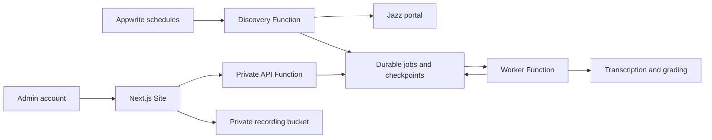

# Appwrite Functions + Sites deployment

Use one project on the existing production Appwrite at
`https://yousufricemill.com/v1`. Appwrite hosts the backend Functions, scheduled
executions, Next.js Site, accounts, database, and private recordings.



The Site calls the API using the Appwrite Server SDK and its scoped execution
key. An additional internal token protects the application routes. All private
requests first verify the visitor's current server-managed `admin` label.
Recordings are read through the authenticated Site route; files and tables have
no public client access. No public backend domain or additional reverse proxy
is needed for this connection.

## Scheduled Functions

Appwrite cron expressions use UTC. Karachi is UTC+05:00.

| Function | Karachi time | Appwrite cron | Purpose |
|---|---|---|---|
| `call-grader-sync` | Daily 18:01 | `1 13 * * *` | Discover the closed office-day batch |
| `call-grader-catchup` | Hourly at :01 | `1 * * * *` | Recover missed discovery or a failed date |
| `call-grader-worker` | Every minute | `* * * * *` | Resume the durable queue and expired leases |
| `call-grader-maintenance` | Daily 02:30 | `30 21 * * *` | Delete expired recordings |

The API and catch-up watchdog handle short requests. Their platform timeout is
900 seconds so asynchronous verification and scheduled executions allow a cold
runtime to start. Appwrite synchronous SDK requests remain limited to 30 seconds.
The watchdog starts discovery asynchronously. Discovery and worker Functions have a 900-second
platform timeout and stop child workloads after 840 seconds. A worker execution
handles one job, then starts an asynchronous successor if due work remains.
Transcription saves ten-minute audio chunks; Roman Urdu conversion saves small
batches. Progress persists in Appwrite, so a terminated execution resumes.
Transactional database leases prevent overlapping scheduled workers. Temporary
audio is removed when an execution finishes or times out; durable checkpoints
and private recordings remain in Appwrite.

Office hours are 09:30–18:00. Processing starts at 18:01 Karachi. Calls after
18:00 join the following day's batch. A first morning deployment waits for
18:01; an existing installation catches up missed closed days automatically.

## Run the same deployment locally first

The local helper reuses the existing private repository `.env` and the linked
localhost project. Allow at least 8 GB of free disk for native builds. It
packages source without environment files, builds Functions sequentially,
removes their completed local build containers, deploys the Site, and stops the old local Docker worker/scheduler before
enabling Function schedules to avoid duplicate processing.

```sh
uv run --project services/backend python scripts/deploy_appwrite.py configure --local
uv run --project services/backend python scripts/deploy_appwrite.py deploy --local
```

Appwrite generates the local Site address under `sites.localhost`; use that
address to test the deployed Site. Docker's port 3000 remains an optional local
preview. Local Function/Site server calls use `host.docker.internal` to reach
the existing local Appwrite API.

## Initial deployment from your computer

Prerequisites:

- Existing Appwrite with Functions and Sites enabled, and an available Python
  `python-3.12` runtime. Keep the existing Appwrite installation.
- The server's `_APP_FUNCTIONS_TIMEOUT` must allow 900 seconds. Check its installed
  version's configuration if it uses a different timeout setting.
- Builds need internet access to Python and Alpine package repositories.
- Appwrite CLI logged into the production instance, Python 3, and this repository.
- Production project created in Console. Add your project account and give it
  the exact `admin` label under **Auth → Users**.

If Python 3.12 is disabled, add `python-3.12` to `_APP_FUNCTIONS_RUNTIMES` in the
existing Appwrite server's `.env`, preserving other runtimes. Recreate the API
and executor services using the existing Compose file and `--pull never`. For
the standard Compose service names:

```sh
docker compose up -d --no-deps --pull never appwrite openruntimes-executor
```

Do not reinstall Appwrite or replace its data volumes.

Run in the repository:

```sh
appwrite login --endpoint https://yousufricemill.com/v1
python3 scripts/deploy_appwrite.py configure --project-id YOUR_PRODUCTION_PROJECT_ID
python3 scripts/deploy_appwrite.py deploy
```

`configure` asks for the OpenAI and Jazz credentials using hidden input, generates
an internal token, and writes `.env.appwrite-production.json` with owner-only
permissions. This file is ignored by Git. Functions use Appwrite's automatically
scoped execution keys; no permanent Appwrite server key is required.

`deploy` creates/updates only this app's six Functions and one Site. It keeps
schedules paused while deploying, sets role-specific variables without replacing
unrelated variables, provisions the database and private bucket through the
bootstrap Function, checks pipeline imports and Chromium/FFmpeg/FFprobe inside every pipeline Function,
verifies API readiness, builds the Site, then enables schedules and starts the initial catch-up. A runtime startup timeout is retried twice; application errors stop deployment with schedules paused. Old inactive deployments have a seven-day retention setting. Bootstrap has no schedule and loses its
write scopes after provisioning. Future deployments restore those scopes only
for schema preparation.

The deployment helper explicitly targets the production endpoint/project and
uses a temporary manifest. The root `appwrite.config.json` remains linked to the
local development project. Do not run `appwrite push all` against production.

## GitHub deployments through Console

Repository: `MuhammadWahajYousufzai/call-grader`, branch `main`.

For the Site, connect GitHub with root directory `apps/web`, framework `nextjs`,
adapter `ssr`, build runtime `node-22`, install command
`npm install -g pnpm@12.6.0 && pnpm install --frozen-lockfile`, build command
`pnpm build`, and output directory `.next`.

For each Function, connect the same GitHub repository with root directory `.`,
Python 3.12, and these settings:

| Function | Entrypoint | Build command |
|---|---|---|
| API | `infra/appwrite/api.py` | `sh infra/appwrite/build.sh api` |
| Discovery | `infra/appwrite/sync.py` | `sh infra/appwrite/build.sh pipeline` |
| Catch-up watchdog | `infra/appwrite/catchup.py` | `sh infra/appwrite/build.sh api` |
| Worker | `infra/appwrite/worker.py` | `sh infra/appwrite/build.sh pipeline` |
| Retention | `infra/appwrite/maintenance.py` | `sh infra/appwrite/build.sh api` |
| Bootstrap | `infra/appwrite/bootstrap.py` | `sh infra/appwrite/build.sh api` |

Keep execution permissions empty: only server keys execute these Functions.
The CLI manifest records scopes, specifications, and cron settings. Preserve
the role-specific variables installed by the deployment helper. Native browser,
Node, and audio libraries are packaged in the build artifact because Python's
standard Appwrite runtime is Alpine. Changing that runtime requires rerunning
its native runtime check. The build script runs import checks and, for native
Functions, Chromium/FFmpeg/ffprobe checks before a GitHub deployment can activate.

The Site scopes are `sessions.write`, `execution.write`, and `files.read`.
Its required variables are `APPWRITE_BACKEND_FUNCTION_ID=call-grader-api` and the
secret `INTERNAL_API_TOKEN`. The helper also sets server-side `APPWRITE_ENDPOINT`
and `APPWRITE_PROJECT_ID` to the target API (a Docker-accessible endpoint locally). Appwrite injects the Site endpoint/project and
execution key. The helper also sets `APPWRITE_RECORDINGS_BUCKET_ID`.

Choose the Site domain in Console, for example `calls.yousufricemill.com`, and
configure DNS/TLS using the existing Appwrite hosting setup. This frontend domain
is the only public application address required. Appwrite's own reverse proxy
routes HTTPS requests to the Site; the backend uses private SDK executions.

## Verify production

Sign in with the admin account, open Dashboard and System, and confirm the next
schedule, latest discovery result, queue state, and recording playback. A
non-admin account must be denied. Review Function build/execution errors in
Console if a deployment or scheduled execution fails. The cron watchdogs retry
ordinary runtime failures automatically; daily operation requires only reviewing
the dashboard.

Production credentials, project creation, DNS, and the actual production
execution must be verified on the target instance before declaring it deployed.
The older Docker deployment helper remains an optional fallback in
[PRODUCTION_SETUP.md](PRODUCTION_SETUP.md).
